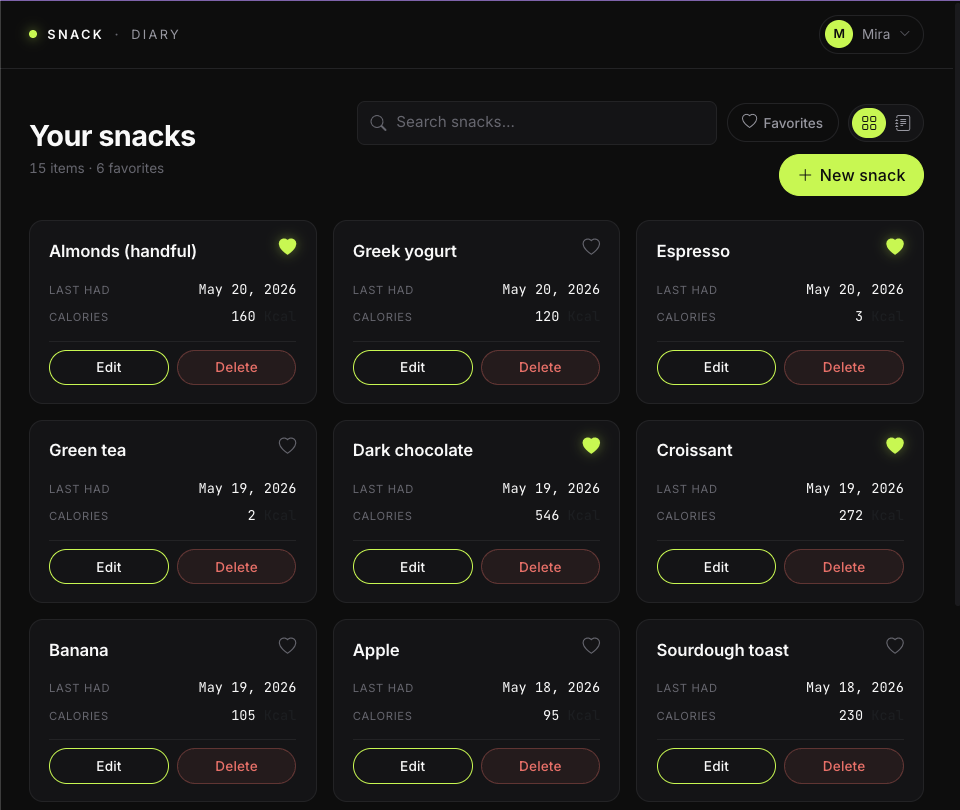
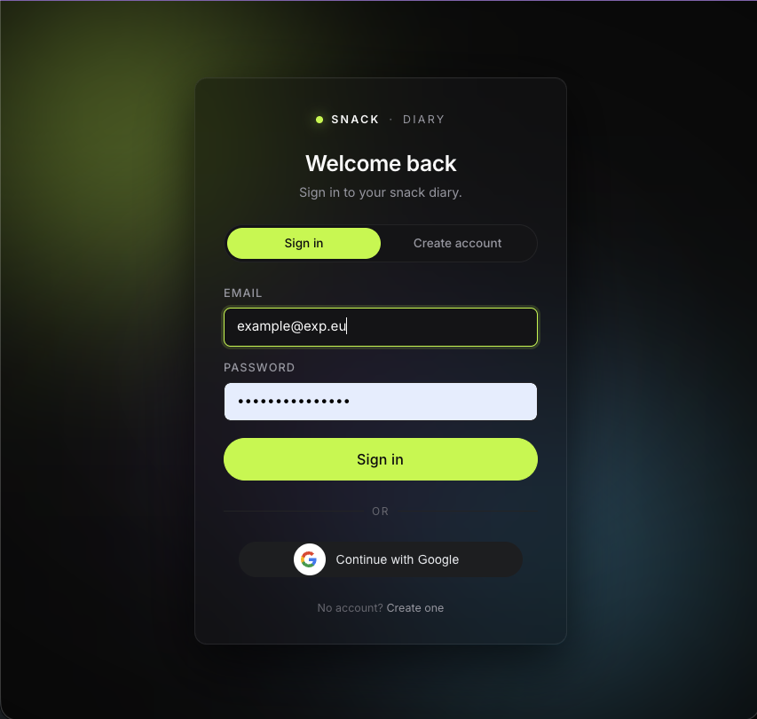
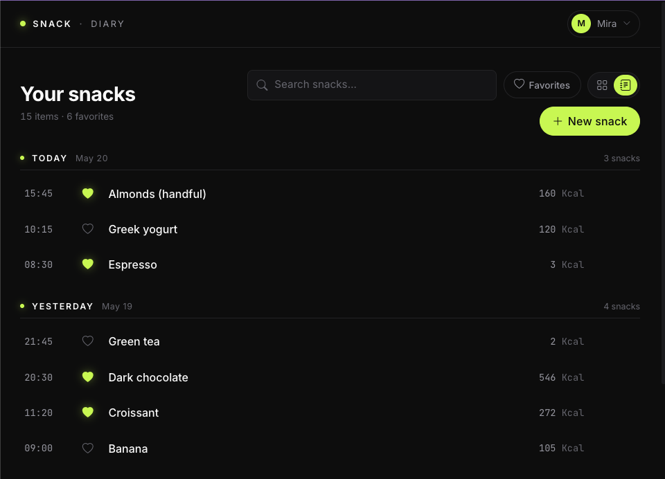
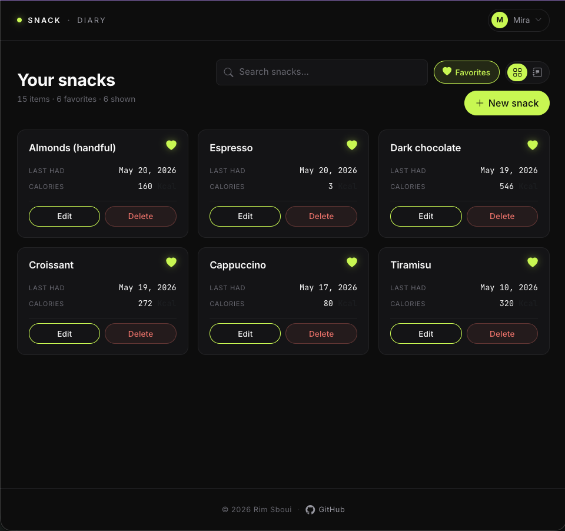
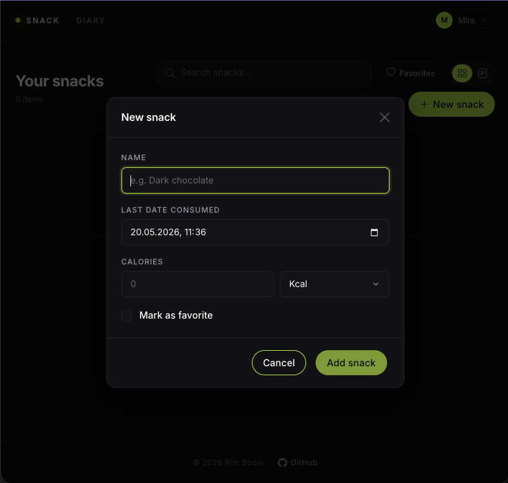
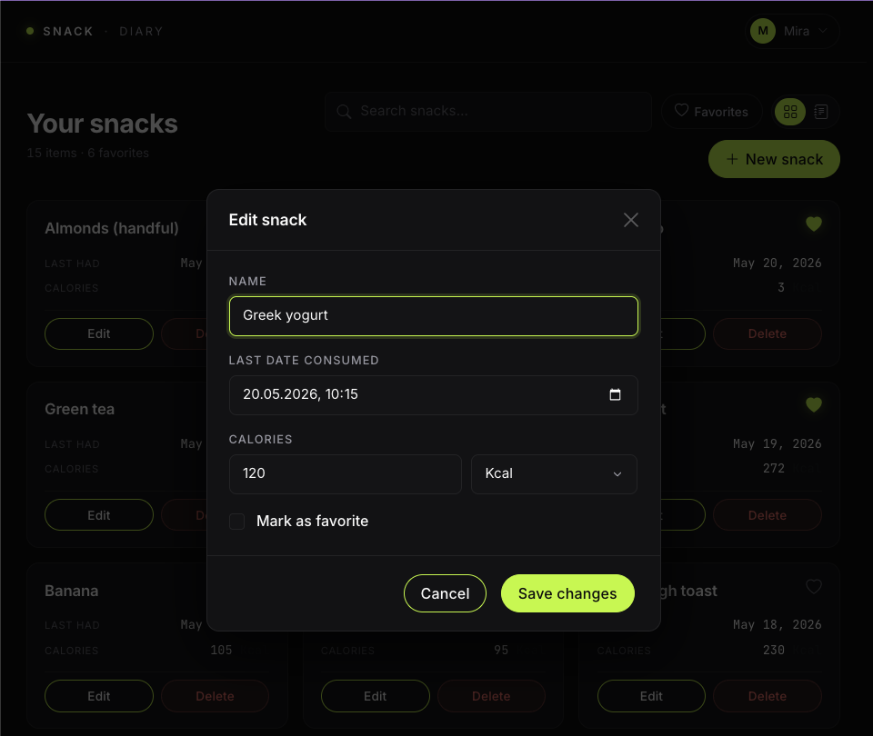
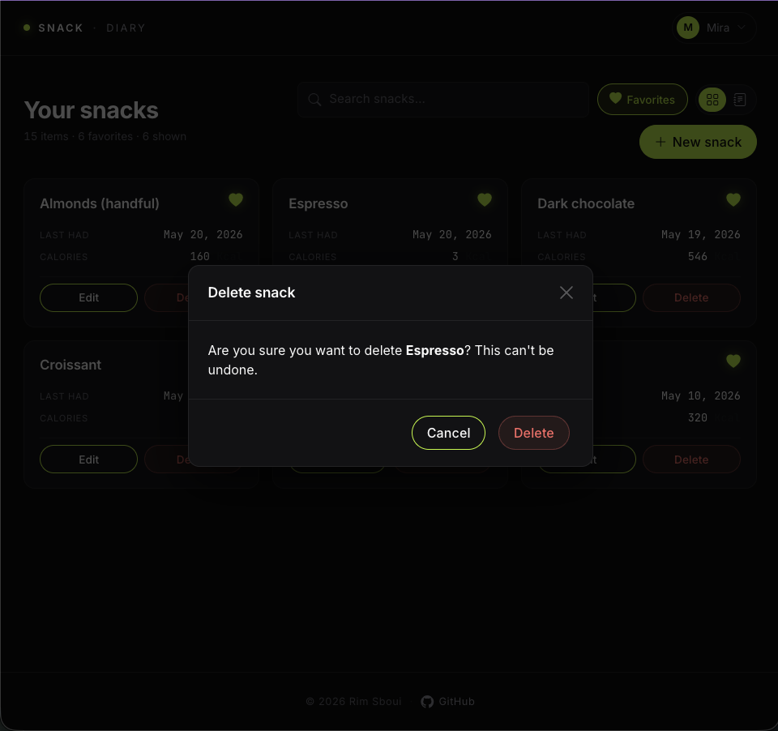
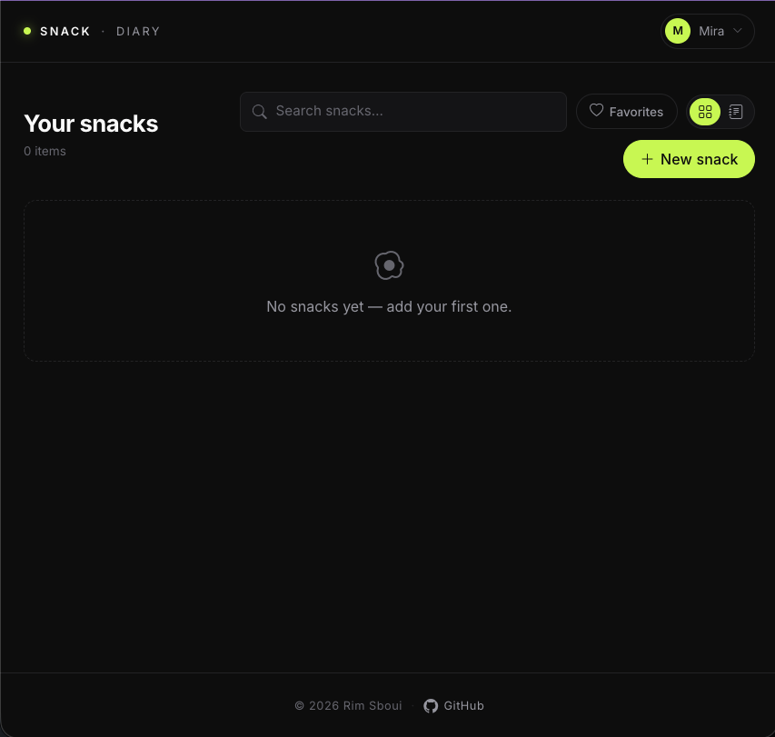

# Foody — MERN Snack Diary

[](https://gitlab.com/rimssboui/foody-crud-mern/-/commits/main)

A small full-stack snack-tracking app with a per-user diary, dark mono UI, and JWT + Google sign-in. Built as a portfolio piece on a clean MERN stack: React 19 + Vite on the front, Express 5 + Mongoose on the back.



## Features

- **Per-user accounts** — register with email/password or sign in with Google. JWT-protected API, bcrypt-hashed passwords, sessions persisted to `localStorage` and rehydrated through `/auth/me`.
- **Two views, one click apart** — Grid (cards) and Diary (snacks grouped by `Today / Yesterday / weekday`).
- **Favorites filter & search** — compose freely across views. Type to filter by name, toggle the heart pill to show only favorites.
- **CRUD with feel** — create, edit, and delete snacks through modal forms; framer-motion handles stagger-in, layout reflow on filter, and exit animations on delete.
- **Modern dark UI** — design tokens via CSS custom properties, lime (`#c5fb45`) accent, Inter + JetBrains Mono fonts, fully responsive grid (1 → 4 columns), glass-blur login background, restyled Bootstrap modals/forms.

## Screenshots

### Login page

Dark mono theme with drifting glass-blur background and Google sign-in.



### Diary view

Snacks grouped by day with `Today / Yesterday / weekday` headers, time stamps, and inline actions on hover.



### Favorites filter

Toggle the Favorites pill to filter both Grid and Diary views.



### Add / edit / delete

<p>
  
  
  
</p>

### Empty state



## Stack

| Layer    | Tech                                                                                  |
| -------- | ------------------------------------------------------------------------------------- |
| Frontend | React 19, TypeScript 5, Vite 6, Zustand, react-bootstrap, framer-motion, react-toastify |
| Auth     | JSON Web Tokens, bcryptjs, Google Identity Services (ID-token flow)                   |
| Backend  | Node 20+, Express 5, Mongoose 8, helmet, rate-limiter-flexible, winston               |
| Database | MongoDB (Atlas or local)                                                              |
| Tooling  | ESLint 9 (flat config), Prettier 3, Docker, docker-compose                            |

## Project layout

```
foody-crud-mern/
├── client/          # React + Vite SPA (login page + main app)
├── server/          # Express API (auth + snack routes)
├── docs/
│   └── screenshots/ # README assets
├── docker-compose.yml
└── README.md
```

## Getting started

### 1. Prerequisites

- Node.js 20 or later
- A MongoDB connection string (free tier on [MongoDB Atlas](https://www.mongodb.com/atlas/database) works fine, or a local `mongod`)
- _Optional_: a Google OAuth 2.0 Client ID — needed only if you want the Google sign-in button. Create one at [console.cloud.google.com](https://console.cloud.google.com/apis/credentials) (Web application; add `http://localhost:3000` under Authorized JavaScript origins). It's free.
- Docker (optional, only for the compose workflow)

### 2. Configure environment

Copy the example files and fill them in:

```bash
cp .env.example .env                 # repo root (used by docker-compose)
cp server/.env.example server/.env   # server config
cp client/.env.example client/.env   # Vite-injected vars
```

Key server vars (`server/.env`):

```bash
MONGO_URI=mongodb://127.0.0.1:27017/foody
JWT_SECRET=change-me-in-production
JWT_EXPIRES_IN=7d
GOOGLE_CLIENT_ID=            # leave empty to disable Google sign-in
CORS_ORIGIN=http://localhost:3000
```

Client (`client/.env`) — both vars are injected at build time:

```bash
VITE_API_URL=http://localhost:3001/api/v1
VITE_GOOGLE_CLIENT_ID=       # same value as server's GOOGLE_CLIENT_ID
```

### 3. Run locally (without Docker)

In two terminals:

```bash
# server
cd server
npm install
npm run dev          # http://localhost:3001

# client
cd client
npm install
npm run dev          # http://localhost:3000
```

Visit http://localhost:3000, register an account (or click *Continue with Google*), and you're in.

### 4. Run with docker-compose

```bash
docker compose up --build
```

Client → http://localhost:3000, server → http://localhost:3001.

## API

Base URL: `/api/v1`. All `/snacks/*` endpoints require a `Authorization: Bearer <jwt>` header.

### Auth

| Method | Path             | Auth     | Description                              |
| ------ | ---------------- | -------- | ---------------------------------------- |
| POST   | `/auth/register` | —        | Create an account (email + password)     |
| POST   | `/auth/login`    | —        | Email/password login → returns JWT       |
| POST   | `/auth/google`   | —        | Verify a Google ID token → returns JWT   |
| GET    | `/auth/me`       | bearer   | Current user from token                  |

### Snacks (per-user)

| Method | Path            | Description       |
| ------ | --------------- | ----------------- |
| GET    | `/snacks`       | List your snacks  |
| POST   | `/snacks`       | Create a snack    |
| PUT    | `/snacks/:id`   | Update a snack    |
| DELETE | `/snacks/:id`   | Delete a snack    |

### Health

| Method | Path        | Description   |
| ------ | ----------- | ------------- |
| GET    | `/healthz`  | Liveness probe |

### Schemas

```ts
type User = {
  _id: string;
  email: string;
  name?: string;
  avatarUrl?: string;
  createdAt: string;
};

type Snack = {
  _id: string;
  userId: string;           // owner, set server-side from the JWT
  name: string;
  lastDayConsumed: Date;
  isFavorite: boolean;
  calories: { value: number; unit: 'Kcal' | 'Kj' };
};
```

## Scripts

From the repo root:

| Command              | What it does                            |
| -------------------- | --------------------------------------- |
| `npm run install:all`| Install dependencies in client + server |
| `npm run lint`       | Lint both packages                      |

## License

MIT — see [LICENSE](./LICENSE) (or the `license` field in `package.json`).

## Author

[Rim Sboui](https://gitlab.com/rimssboui) · [GitHub mirror](https://github.com/reemsb/foody-crud-mern)
